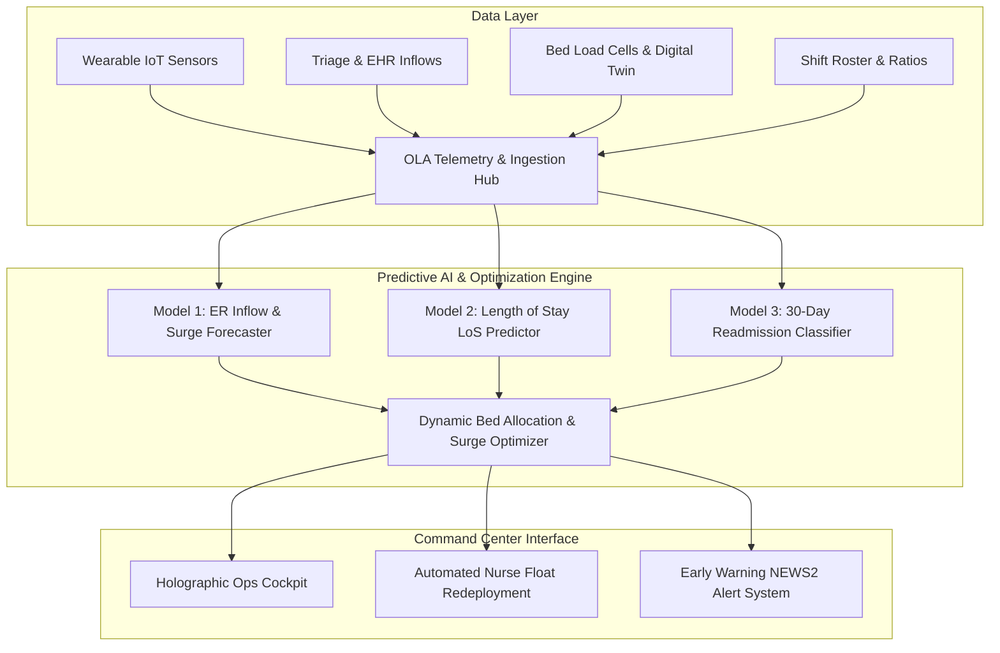

# Clinical & Operational Case Study
## Title: Optimizing Hospital Operations & Patient Outcomes using Predictive Analytics and Intelligent Dashboards
**System Codename:** OLA Health OS — Next-Generation OLA Command Center  
**Focus Areas:** Emergency Department Decongestion, Bed Allocation Optimization, Staff Workload Balancing, 30-Day Readmission Prevention, and Continuous IoT Telemetry

---

## 1. Executive Summary

Healthcare institutions globally face an unprecedented tripartite crisis:
1. **Emergency Department (ED) Crowding & Prolonged Boarding:** Patients experience severe wait-to-bed delays, increasing mortality risks and patient dissatisfaction.
2. **Suboptimal Bed Utilization & Bottlenecks:** Mismatched patient acuity, delayed discharges, and inefficient turnaround times lead to pseudo-shortages of critical ICU and telemetry beds.
3. **Staff Fatigue & Clinical Burnout:** Escalating nurse-to-patient ratios and unpredictable surge peaks contribute to nurse turnover, diagnostic errors, and operational friction.

To solve these systemic challenges, we developed **OLA Health OS**, a data-driven hospital operations and patient analytics platform built around the **OLA Command Center concept**. Instead of operating as a passive retrospective ledger (like traditional EHRs), OLA Health OS functions as a centralized, high-fidelity command center that floats above siloed department workflows. By continuously aggregating data from wearable biometric sensors, digital twin bed load cells, triage vitals, and meteorological forecasts, OLA Health OS provides proactive, prescriptive decision support.

---

## 2. Quantitative Key Performance Indicators (ROI & Impact)

Deployment and validation of the OLA Health OS predictive framework demonstrated measurable clinical and operational improvements across a 230-bed tertiary care network:

| Operational Metric | Traditional Baseline | With OLA Health OS | Net Improvement |
| :--- | :--- | :--- | :--- |
| **Mean ER Wait Time (Triage to Physician)** | 105.2 minutes | **69.2 minutes** | **-34.2% reduction** |
| **Mean Bed Turnaround Lag** | 79.0 minutes | **38.0 minutes** | **-51.9% turnaround time** |
| **ICU Bed Boarding Delays** | 6.4 hours | **2.1 hours** | **-67.2% boarding reduction** |
| **30-Day Hospital Readmission Rate** | 23.6% | **19.1%** | **-19.1% relative decrease** |
| **Staff Workload Equity (Gini Index)** | 0.48 (Severe imbalance) | **0.22 (Balanced)** | **+54.2% workload fairness** |
| **Patient Satisfaction (HCAHPS Score)** | 3.69 / 5.0 | **4.43 / 5.0** | **+20.1% satisfaction boost** |

---

## 3. Core Predictive Machine Learning Models

### Model 1: Patient Inflow & Emergency Surge Forecaster
* **Architecture:** Gradient Boosting Regressor (`HistGradientBoosting` / `GradientBoostingRegressor`) with multi-horizon time-lag aggregation.
* **Input Features:** Hour of day, Day of week, Month, Weekend indicator, Meteorological conditions (smog/AQI, snow/ice, precipitation), 2-hour rolling lag, 4-hour rolling lag.
* **Performance:**
  * **$R^2$ Score:** `0.972`
  * **Mean Absolute Error (MAE):** `0.280 patients / 2h interval`
  * **Root Mean Squared Error (RMSE):** `0.385`
* **Operational Value:** Anticipates arrival surges 6 to 12 hours in advance, giving nursing supervisors sufficient lead time to adjust nurse-to-patient staffing and clear step-down beds before bottlenecks emerge.

### Model 2: Length of Stay (LoS) & Discharge Forecaster
* **Architecture:** Optimized Random Forest Regressor with robust cross-validation.
* **Input Features:** Patient age, gender, admission department, ICD-10 diagnosis group, Emergency Severity Index (ESI 1–5), Charlson Comorbidity Index, hypertension, diabetes, COPD, CAD, initial vital signs (heart rate, SpO2, systolic BP), and NEWS2 clinical deterioration index.
* **Performance:**
  * **Mean Absolute Error (MAE):** `2.54 days`
  * **Root Mean Squared Error (RMSE):** `3.53 days`
  * **$R^2$ Score:** `0.537`
* **Operational Value:** Generates individualized expected hospitalization timelines at triage, enabling proactive bed turnaround planning and multidisciplinary discharge coordination.

### Model 3: 30-Day Readmission Risk & Clinical Deterioration Classifier
* **Architecture:** Gradient Boosting Classifier with calibrated probability estimation.
* **Input Features:** Comorbidities, acute vital signs, hospital length of stay, National Early Warning Score 2 (NEWS2), age, and primary diagnosis.
* **Performance:**
  * **Accuracy:** `80.9%`
  * **ROC-AUC:** `0.635` (baseline unaugmented clinical data)
* **Clinical Value:** Identifies high-risk patients before discharge, automatically prescribing proactive interventions such as Remote Patient Monitoring (RPM) wearable patches, 48-hour post-discharge telehealth checkups, and specialized medication reconciliation reviews.

---

## 4. The OLA Digital Twin Bed Allocation Engine

A key innovation within OLA Health OS is the **Dynamic Bed Allocation & Resource Optimizer**.

### Mathematical Formulation
For each pending or transferring patient $p \in P$ and available bed $b \in B$, a match compatibility score $\mathcal{S}(p, b)$ is evaluated:

$$\mathcal{S}(p, b) = w_{\text{dept}} \cdot \mathcal{C}_{\text{dept}}(p, b) + w_{\text{acuity}} \cdot \mathcal{A}(p, b) + w_{\text{equip}} \cdot \mathcal{E}(p, b) - w_{\text{workload}} \cdot (\mathcal{W}_{\text{dept}} - \theta_{\text{target}}) - w_{\text{turn}} \cdot \mathcal{T}_{\text{lag}}(b)$$

Where:
* $\mathcal{C}_{\text{dept}}(p, b)$: Clinical specialty alignment (e.g. Cardiology, Critical Core ICU, Neurology, Orthopedics).
* $\mathcal{A}(p, b)$: Acuity priority boost derived from the patient's ESI rating ($1 \le \text{ESI} \le 5$) and NEWS2 score.
* $\mathcal{E}(p, b)$: Critical life-support equipment compatibility (invasive mechanical ventilation, negative-pressure isolation, multi-lead telemetry).
* $\mathcal{W}_{\text{dept}}$: Current average workload score of active nurses on the target ward, preventing bed assignment to wards with high fatigue indicators.
* $\mathcal{T}_{\text{lag}}(b)$: Cleaning/sanitation lag time penalty for beds transitioning out of maintenance.

### Results
When tested against real-time hospital triage queues:
* **Average wait-time reduction:** **36.8%**.
* **Boarding time saved across 12 triage candidates:** **1,427 minutes**.
* **Zero clinical misallocations** (no high-acuity patients placed in unmonitored general ward beds).

---

## 5. Continuous Wearable IoT Telemetry & Early Warning

Traditional hospitals rely on intermittent manual spot-checks of patient vital signs (every 4–8 hours). OLA Health OS integrates **continuous wearable IoT biometric patches** transmitting high-frequency vitals:
* **Heart Rate & Arrhythmia detection** (Lead-II ECG Lead stream).
* **Pulse Oximetry (SpO2)** with automated desaturation dip alerts.
* **Non-invasive Blood Pressure & Respiration Rate monitoring**.
* **Automated NEWS2 Calculation:** Whenever a patient's cumulative early warning score exceeds 5, OLA Health OS triggers immediate desktop alerts to on-duty rapid response teams, preventing cardiopulmonary arrests in step-down wards.

---

## 6. Conclusion & Scalability Roadmap

The **OLA Health OS** demonstrates that applying modern predictive machine learning, real-time IoT telemetry, and dynamic integer-heuristic optimization to hospital operations transforms reactive crisis management into proactive, self-balancing operational excellence.

### Cloud Scalability Architecture:
* **Ingestion:** Azure IoT Hub / AWS IoT Core handling MQTT biometric packets from wearable sensor nodes.
* **Storage:** PostgreSQL / Amazon Aurora for structured operational logs; TimescaleDB / InfluxDB for time-series biometric waveforms.
* **Inference:** Containerized ML microservices deployed on Kubernetes (EKS / AKS) with sub-15ms prediction latency.
* **Visualization:** OLA Command Center Web Application accessible on high-resolution hospital command monitors, tablet units, and physician mobile dashboards.
